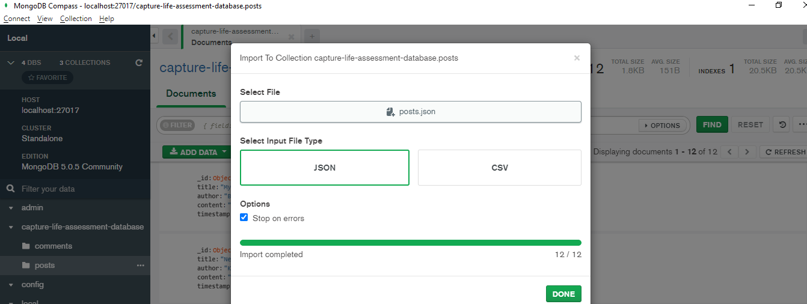
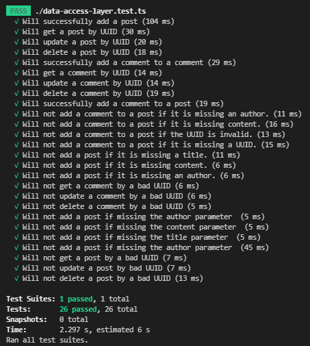

# Populating the database before running the API

Import the data from `$REPO_PARENT_DIRECTORY/capture-life-assessment/mongo-json-dump` into your MongoDB instance. There are (2) collections. One is for `posts` and the other is for `comments`. The UUIDs (`_ids`) are relied upon in the unit test's, and certain tests will fail if the data does not match what is expected. If you do not need to run the tests you may alternatively run `npm run seed` within the `$REPO_PARENT_DIRECTORY/capture-life-assessment/data-access-layer` NodeJS module and it will generate 25 comments and posts with unique ID's and then populate your MongoDB database instance with the new records. 

# Importing the test data into your MongoDB instance
1. First, make sure your local or hosted version of MongoDB is running and can connect to your [MongoDB Compass](https://www.mongodb.com/try/download/compass) installation. Notice the absence of the `capture-life-assessment-database`. 

2. Run the `npm i` command at the root of the project in order to setup the schema and validators in your database.

3. Give it a few seconds to process once being run. When you refresh your collection list (left navigation, refresh button on the right-hand side). You should see the new collections `comments` and `posts`. 
> If you select either collection, and then the `validation` tab you will see the JSON schema validation rules for the documents within each collection.

4. Go to the top horizontal menu after selecting the `comments` collection. You will see the menu options `Connect`, `View`, `Collection` and `Help`. Goto the `Collection` menu item, then select the menu option for `Import Data` and then choose the `comments.json` file located within this repository in the `$REPO_PARENT_DIRECTORY/capture-life-assessment/mongo-json-dump/` directory. In the dialog window which appears, check the checkbox for `Stop on errors` and then click the `IMPORT` button.  

5. You should now see the collection populate with the documents from the JSON dump.

6. Go to the top horizontal menu after selecting the `comments` collection. You will see the menu options `Connect`, `View`, `Collection` and `Help`. Goto the `Collection` menu item, then select the menu option for `Import Data` and then choose the `posts.json` file located within this repository in the `$REPO_PARENT_DIRECTORY/capture-life-assessment/mongo-json-dump/` directory. In the dialog window which appears, check the checkbox for `Stop on errors` and then click the `IMPORT` button. You should now see the `posts.json` documents populate within the `posts` collection behind the dialog. 

7. Go to the `$REPO_PARENT_DIRECTORY/capture-life-assessment/` directory and execute the unit tests in order to validate the integrity of the data-access layer as well as the inserted data.

8. Import the Postman suite (formatted using 2.1), located in the `$REPO_PARENT_DIRECTORY/capture-life-assessment/test/api-testing` into your Postman client. Each endpoint should include UUID's from the data from the import conducted in this walk-through and work as defined in the requirements.